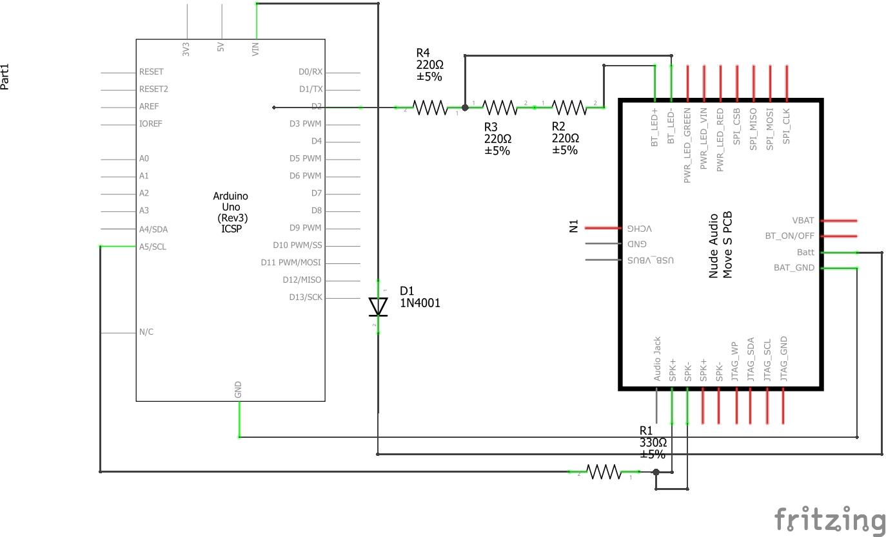

# Nude Audio Move S Readable Bluetooth Controller

With The provided code, an Arduino and a bit of tinkering (the see wiki/circuitry), you can turn your Nude Audio Move S circuit into an
low-key read-only Arduino bluetooth controller.

The controller provides the Arduino with a variety of signals which can be interpreted and trigger a certain event.

For instance, using the sound volume signal (```move_s.spk->sig(volume))```), the Arduino may be controlled trough Bluetooth with the use of sound.   




Layouts made using Fritzing

### Wiki
To keep things tidy, all documentation is available on the wiki.

### Q&A

Q: Will I be able to emmit Bluetooth signals?

A: No, as the title mentions, the code only provides readable data. To put this into perspective, you may
   connect your device to the Move S circuit and transmit sound data. The Arduino can read this sound data and can act according to it.
   However, the Arduino cannot respond to the paired device (at least not using this library) as it has no control over the Move S circuit whatsoever
